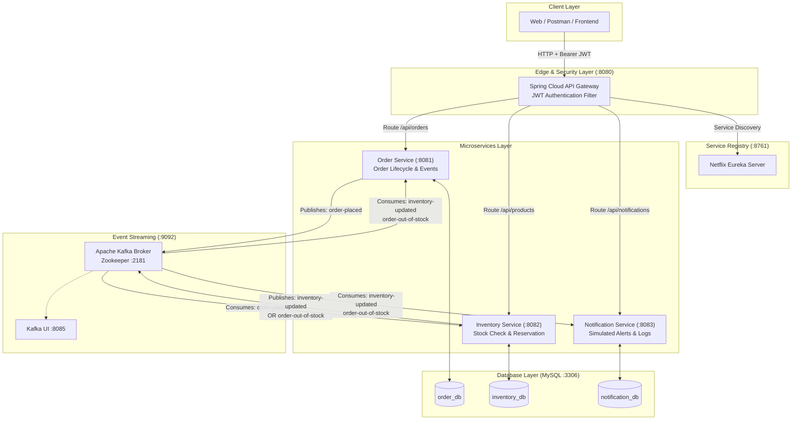

# 🚀 Order & Inventory Management System (Spring Boot Microservices)

A production-ready, event-driven microservices architecture built with **Java 17**, **Spring Boot 3.3**, **Spring Cloud (Eureka + Gateway)**, **Apache Kafka**, **MySQL (Database-per-service)**, **Spring Security (JWT)**, and **Docker Compose**.

---

## 📑 Table of Contents
1. [Architecture Overview](#-architecture-overview)
2. [Services & Port Allocations](#-services--port-allocations)
3. [Tech Stack](#-tech-stack)
4. [Kafka Event-Driven Workflow](#-kafka-event-driven-workflow)
5. [Kafka Topics & JSON Payloads](#-kafka-topics--json-payloads)
6. [Security & JWT Authentication Flow](#-security--jwt-authentication-flow)
7. [REST API Endpoints & Documentation](#-rest-api-endpoints--documentation)
8. [Getting Started & Local Setup](#-getting-started--local-setup)
9. [Testing & Verification](#-testing--verification)
10. [Kubernetes Deployment Guide](#-kubernetes-deployment-guide)
11. [Architectural Decisions & Tradeoffs (Interview Talking Points)](#-architectural-decisions--tradeoffs)

---

## 🏛 Architecture Overview



---

## 🌐 Services & Port Allocations

| Service | Responsibility | Port | Database / Persistence |
| :--- | :--- | :--- | :--- |
| **Web Dashboard** | Modern Web UI & Live Kafka Saga visualizer | `3000` | Static / Nginx |
| **API Gateway** | Single entry point, JWT validation, dynamic routing, CORS | `8080` | Stateless (In-memory user store) |
| **Order Service** | Create/manage orders, publish order events, state updates | `8081` | MySQL (`order_db`) |
| **Inventory Service** | Product catalog, stock tracking, event-driven deduction | `8082` | MySQL (`inventory_db`) |
| **Notification Service** | Consume events, simulate email/SMS alerts, audit logs | `8083` | MySQL / H2 (`notification_db`) |
| **Eureka Server** | Service discovery and registration registry | `8761` | In-memory registry |
| **Apache Kafka** | Distributed pub/sub event broker | `9092`, `29092` | Log segments |
| **Zookeeper** | Kafka cluster coordination | `2181` | Quorum metadata |
| **MySQL Database** | Relational multi-schema storage | `3306` | Persistent volume |
| **Kafka UI** | Visual web console for Kafka topics and messages | `8085` | N/A |

---

## 🛠 Tech Stack

- **Core Framework**: Java 17, Spring Boot 3.3.3
- **Cloud & Microservices**: Spring Cloud 2023.0.3 (Spring Cloud Gateway, Netflix Eureka)
- **Messaging & Event Streaming**: Apache Kafka, Spring Kafka
- **Persistence**: Spring Data JPA, Hibernate, MySQL 8, H2 Database
- **Security**: Spring Security, JSON Web Tokens (JJWT 0.12.5)
- **API Documentation**: Springdoc OpenAPI 3 / Swagger UI
- **Observability**: Spring Boot Actuator (`/actuator/health`, `/actuator/metrics`)
- **DevOps & Containers**: Docker, Docker Compose, Kubernetes manifests
- **Build Tool**: Apache Maven (Multi-Module Project)

---

## ⚡ Kafka Event-Driven Workflow

1. **Order Creation**:
   - Client sends `POST /api/orders` to the API Gateway with JWT.
   - Gateway validates token and routes request to **Order Service**.
   - Order Service persists the order in `order_db` with status `PENDING`.
   - Order Service immediately publishes an `order-placed` event to Kafka and returns HTTP 201 (`{ orderId: 1001, status: "PENDING", ... }`).
2. **Stock Verification & Deduction**:
   - **Inventory Service** consumes the `order-placed` event from Kafka.
   - It checks `available_quantity` in `inventory_db` for the requested `productId`.
   - **Scenario A (Sufficient Stock)**:
     - Deducts available stock, updates reserved stock in DB.
     - Publishes `inventory-updated` event (`status: "CONFIRMED"`).
   - **Scenario B (Insufficient Stock / Out of Stock)**:
     - Leaves inventory untouched.
     - Publishes `order-out-of-stock` event (`status: "OUT_OF_STOCK"`).
3. **Order Status Finalization**:
   - **Order Service** consumes `inventory-updated` or `order-out-of-stock`.
   - Updates order status in `order_db` to `CONFIRMED` or `OUT_OF_STOCK`.
4. **Customer Notification**:
   - **Notification Service** consumes the result events and dispatches simulated email/SMS logs to the console and writes to `notification_logs`.

---

## 📨 Kafka Topics & JSON Payloads

### 1. `order-placed`
- **Producer**: `order-service`
- **Consumer**: `inventory-service`
```json
{
  "orderId": 1001,
  "productId": 55,
  "quantity": 2,
  "customerId": 101,
  "timestamp": "2026-08-31T10:15:00"
}
```

### 2. `inventory-updated`
- **Producer**: `inventory-service`
- **Consumers**: `order-service`, `notification-service`
```json
{
  "orderId": 1001,
  "productId": 55,
  "status": "CONFIRMED",
  "remainingStock": 48
}
```

### 3. `order-out-of-stock`
- **Producer**: `inventory-service`
- **Consumers**: `order-service`, `notification-service`
```json
{
  "orderId": 1001,
  "productId": 55,
  "status": "OUT_OF_STOCK",
  "reason": "Insufficient stock"
}
```

---

## 🔐 Security & JWT Authentication Flow

### Authentication Endpoint
`POST http://localhost:8080/auth/login`
```json
{
  "username": "admin",
  "password": "admin123"
}
```
**Sample Response**:
```json
{
  "token": "eyJhbGciOiJIUzI1NiJ9.eyJzdWIiOiJhZG1pbiIsInVzZXJJZCI6MSwicm9sZSI6IkFETUlOIiwiZXhwIjoxNzU2NzQ1NjAwfQ...",
  "type": "Bearer",
  "userId": 1,
  "username": "admin",
  "role": "ADMIN",
  "expiresInMs": 86400000
}
```

### Preconfigured Test Users
- **Admin**: `admin` / `admin123` (Role: `ADMIN`, ID: `1`)
- **Customer 1**: `john` / `password123` (Role: `CUSTOMER`, ID: `101`)
- **Customer 2**: `jane` / `password123` (Role: `CUSTOMER`, ID: `102`)

### Header Propagation
The API Gateway validates the Bearer token and forwards enriched headers to downstream microservices:
- `X-User-Id`: Authenticated user ID
- `X-User-Role`: User authority/role
- `X-User-Name`: Username

---

## 📡 REST API Endpoints & Documentation

### 1. Order Service Endpoints (`/api/orders`)
| Method | Endpoint | Description |
| :--- | :--- | :--- |
| `POST` | `/api/orders` | Create a new order (status `PENDING`, publishes Kafka event) |
| `GET` | `/api/orders/{id}` | Get order details by order ID |
| `GET` | `/api/orders?page=0&size=10` | List all orders with pagination & sorting |
| `GET` | `/api/orders/customer/{customerId}` | List all orders placed by a customer |
| `PUT` | `/api/orders/{id}/cancel` | Cancel an order |

### 2. Inventory Service Endpoints (`/api/products`)
| Method | Endpoint | Description |
| :--- | :--- | :--- |
| `GET` | `/api/products` | List all products in catalog |
| `GET` | `/api/products/{id}` | Get product details by product ID |
| `POST` | `/api/products` | Add a new product to catalog (Admin) |
| `PUT` | `/api/products/{id}/stock` | Update stock levels manually (Admin) |

### 3. Notification Service Endpoints (`/api/notifications`)
| Method | Endpoint | Description |
| :--- | :--- | :--- |
| `GET` | `/api/notifications` | Get recent 50 simulated notification logs |
| `GET` | `/api/notifications/order/{orderId}` | Get notification logs for a specific order |

### 4. Interactive Swagger UI Docs
- Order Service Swagger: `http://localhost:8081/swagger-ui.html`
- Inventory Service Swagger: `http://localhost:8082/swagger-ui.html`
- Notification Service Swagger: `http://localhost:8083/swagger-ui.html`

---

## 🚀 Getting Started & Local Setup

### Prerequisites
- Java 17+ JDK
- Apache Maven 3.8+
- Docker & Docker Compose

### 1. Clone & Build All Microservices
```bash
# Navigate to the project directory
cd order-inventory-system

# Build all modules and run unit tests
mvn clean package
```

### 2. Run with Docker Compose
```bash
# Start all microservices, Kafka, MySQL, Eureka, Gateway, and Kafka UI
docker-compose up --build -d

# View live logs across all containers
docker-compose logs -f
```

### 3. Verify Health & Service Discovery
- Eureka Dashboard: [http://localhost:8761](http://localhost:8761)
- Kafka UI Web Console: [http://localhost:8085](http://localhost:8085)
- API Gateway Health: [http://localhost:8080/actuator/health](http://localhost:8080/actuator/health)

---

## 🧪 Testing & Verification

### Using VS Code / IntelliJ REST Client (`requests.http`)
Open [requests.http](requests.http) to execute complete end-to-end flows directly in your IDE:
1. Login to obtain JWT
2. Inspect catalog products
3. Place order for product 55 (success flow)
4. Place order with excessive quantity (out of stock flow)
5. Verify order status transition from `PENDING` -> `CONFIRMED`
6. Verify notification audit logs

### Using Postman
Import [Order_Inventory_Microservices.postman_collection.json](Order_Inventory_Microservices.postman_collection.json) into Postman. The login request automatically captures and sets the `jwt_token` environment variable for subsequent requests.

### Running Automated Unit Tests
```bash
mvn test
```

---

## ☸️ Kubernetes Deployment Guide

The `k8s/` folder contains Kubernetes manifests ready for Minikube, Kind, or cloud clusters (EKS/GKE/AKS):

```bash
# 1. Create namespace
kubectl apply -f k8s/01-namespace.yaml

# 2. Deploy infrastructure (MySQL, Zookeeper, Kafka)
kubectl apply -f k8s/02-mysql.yaml
kubectl apply -f k8s/03-kafka.yaml

# 3. Deploy Eureka Server
kubectl apply -f k8s/04-eureka-server.yaml

# 4. Deploy Spring Boot Microservices
kubectl apply -f k8s/05-inventory-service.yaml
kubectl apply -f k8s/06-order-service.yaml
kubectl apply -f k8s/07-notification-service.yaml

# 5. Deploy API Gateway
kubectl apply -f k8s/08-api-gateway.yaml

# Check pod status
kubectl get pods -n order-inventory-system
```

---

## 💡 Architectural Decisions & Tradeoffs

### 1. Why Kafka over Synchronous REST for Inter-Service Communication?
- **Temporal Decoupling**: If the Inventory Service is temporarily restarting or experiencing latency, the Order Service does not block or fail customer orders. It persists orders as `PENDING` and publishes the event to Kafka.
- **Traffic Spike Buffering**: Kafka acts as a shock absorber during high-concurrency flash sales (e.g., Black Friday). Downstream services consume at their own processing capacity without dropping requests.
- **Publish-Subscribe Scalability**: A single event (`inventory-updated`) is consumed independently by both `order-service` and `notification-service` without requiring the producer to know who the consumers are.

### 2. Why Database-per-Service?
- **Loose Coupling & Domain Autonomy**: The Order domain and Inventory domain are independent. Changes to the inventory schema (e.g. adding warehouse bins or suppliers) never impact or lock tables in the order schema.
- **Independent Scalability**: High-throughput catalog reads can scale independently with read replicas or caching without bottlenecking transactional order writes.

### 3. API Gateway JWT Offloading vs Zero Trust Defense-in-Depth
- **Gateway Validation**: Centralizing JWT validation at the API Gateway keeps microservices lean and prevents duplicated authentication logic.
- **Internal Network Trust vs Token Forwarding**: In this setup, the Gateway validates the JWT and propagates user identity headers (`X-User-Id`, `X-User-Role`) internally. In high-security Zero Trust enterprise environments, services can additionally verify JWT signatures locally.

### 4. Eventual Consistency vs Two-Phase Commit (2PC)
- Distributed 2PC transactions cause high latency, locking, and single-points-of-failure across microservices.
- We utilize the **Choreography-based Saga Pattern** with asynchronous Kafka events. The order begins in `PENDING` and eventually transitions to `CONFIRMED` or `OUT_OF_STOCK`, ensuring high availability and ACID guarantees within each service boundary.
